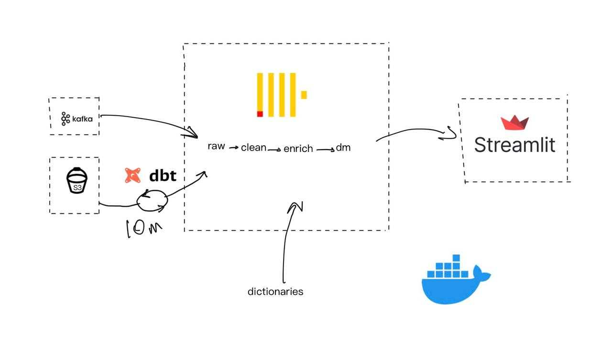

# Лаба 8 Проект - Транзакционная аналитика

<<<<<<< HEAD


## Kafka and Clickhouse
После создания табличек на основе dbt, что собирают по расписанию s3 мы создадим таблицы, materialized view к ним для соединения батч и стрим слоя, дедупликации и обогащения данными справочниками и аггрегациями.

Для этого перейдем в папку kafka_click_table_creation и пропишем, не забыв заменить креды на свои
```
chmod +x click_table_creation
./click_table_creation
```
После этого создадутся таблицы пригодные для использования в дашборде 
=======

>>>>>>> 70ac4b7a36708b9f888709c73c8c2ae68e981e24

## Streamlit

Задать переменные окружения click_user, click_port, click_pass
Затем запускаем streamlit

```
cd streamlit
chmod +x run_streamlit
./run_streamlit
```

После этого на 8501 развернется streamlit, открываем через браузер http://i.p.add.ress:8501
